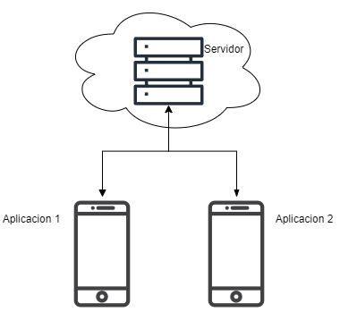

# Proyecto E

Este es un proyecto personal que he desarrollado para una persona especial en mi vida… 

No es con fines de lucro ni con intenciones de ser publicado en ningún lugar.

Consta de:

-Servidor (Este proyecto, desarrollado con python utilizando el framework FastApi. En forma de microservicios)

-Cliente (Aplicación móvil en Flutter, desarrollada con Dart)

El servidor está desplegado en Digital Ocean en un Ubuntu server virtual (Pronto será hosteado localmente por mí)

Los endpoints del servidor están listados en el archivo de postman incluído en el proyecto

Este proyecto se encuentra en constante desarrollo y puede que no se actualice en un rato
